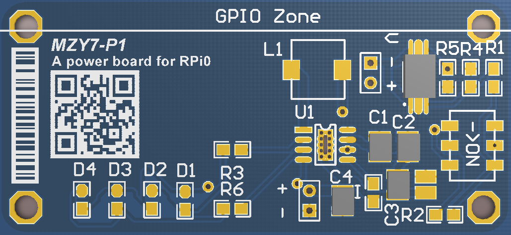

# MZY7-P1
#### Designed by XAS-712 with AD10

嗯，这是一块放在RPi0底部的电源板。

估计是市面上第一款。
（今天又去TB上逛了下的确没有这类不占GPIO口的，看来是第一款）

## 产品特点
- 完全符合RPi0的外形
- 4色LED电量显示
- 同步升压输出
- 全固态电容
- 独有的电源开关设计
- 无需外接至RPi0的USB线
- （可选）1600mAH聚合物锂电池

## 组装说明
- 首先你得先打样PCB（tip：可以拼三块拼成6.5\*9cm，节省费用）
1. 焊接左侧的LED（D1-D4）及限流电阻（R3、R6）
2. 焊接主芯片（U1）（注意要焊接好底部的AGND焊盘）和电感（L1）
3. 焊接充电电流设置电阻（I）、5V侧电容（C1-C3-C2）（最好按照该顺序，以防遮挡）
4. 焊接输出控制场管（Q1）、外围电阻（R1、R2、R4、R5）及开关（标`->ON`处）
5. 焊接电池侧电容（C4）
6. 连接GND跳线（位于C3右侧）（将两焊盘短路或贴0R都可）
7. 将电池接线焊接在电池输入口（位于C4左侧）并将电池粘贴于PCB背面（记得做好绝缘，如果电池外皮导电的话）

- **重要***从这开始，PCB上带电，请操作时谨慎！*

8. 将开关关闭，在5V接口（V）焊接两根接线，另一端焊接在RPi0的`PWR IN`USB接口反面的两个调试焊盘上（请务必再三检查极性，以免造成损失）
9. 打开开关，RPi0将会开机

## 使用方法
组装完成后，MZY7-P1会为RPi0提供电源。
### 如何充电？
连接充电线到RPi0的`PWR IN`USB接口。
### 如何关掉它？
关闭位于右侧的开关即可。

*注：关闭后，如果接入电源，那么仍然会进行充电，但此时RPi0的电源仅由外部供电提供。
断开电源，你的RPi0将会关机。*
